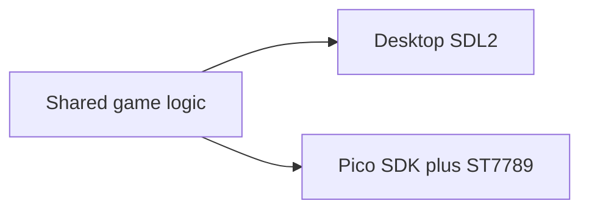

# SYDEQuest

**SYDEQuest** is a **2D platformer** written in **C++17** with one shared game core and two targets: a **desktop** build (SDL2) for development and play-testing, and a **Raspberry Pi Pico 2** build with an **ST7789** display, analog joystick, buttons, and optional **DRV2605** haptics. The game is themed around SYDE coursework motifs: **boss fights** include laser-style patterns, summoner-style encounters, and projectile-heavy arenas.

## Features

- **Seven levels** with tile-based terrain, **portals** between stages, **health packs**, and shooting.
- **Per-level objectives** (for example charger, enclosure, haptic, parts, screen, and Pico-themed goals) that must be completed alongside reaching the exit.
- **Boss levels** on stages 3, 5, and 7, featuring **Sean Speziale** (summoner), **Robert Hunter** (laser-focused), and **Calvin Young** (projectiles and shrapnel-style patterns).
- **Game flow**: main menu, gameplay, game over, and a completion (“You Passed”) state.
- **Resolution**: **320×240** logical pixels (desktop window is scaled for visibility; the Pico uses the same logical size in landscape after display rotation).

## Repository layout

| Path | Role |
|------|------|
| `Shared/` | Platform-independent game logic, physics, levels API |
| `Desktop/` | SDL2 renderer, input, timer, haptics stubs |
| `Pico/` | Pico SDK renderer, GPIO/ADC input, DRV2605 haptics, embedded assets |
| `levels/` | `Level1.csv` … `Level7.csv` — level source (CSV + metadata lines) |
| `tools/` | e.g. `csv_to_binary_header.py` to regenerate embedded Pico level headers |

CMake selects the target with **`TARGET_PLATFORM`**: `desktop` (SDL2) or `pico` (Pico SDK). If **`PICO_SDK_PATH`** is set when you configure, CMake defaults to **`pico`**; if not, it defaults to **`desktop`**. To force a target, pass **`-DTARGET_PLATFORM=desktop`** or **`-DTARGET_PLATFORM=pico`**.



---

## Running on PC (desktop)

### Prerequisites

- **CMake** 3.13 or newer  
- A **C++17** compiler  
- **Ninja** or another generator (the repo’s VS Code settings assume Ninja)  
- **SDL2**, **SDL2_image**, and **SDL2_ttf** — install via your platform (e.g. vcpkg, MSYS2, apt, Homebrew) so CMake can find them with `find_package`.

### Configure and build

Unset **`PICO_SDK_PATH`** for this shell session (or pass **`-DTARGET_PLATFORM=desktop`** explicitly) so the desktop target is selected.

```bash
cmake -S . -B build -DTARGET_PLATFORM=desktop
cmake --build build
```

The executable is **`platformer`** (or `platformer.exe` on Windows).

### Run

Run from the **repository root** (or from typical CMake output folders under `build/` — `Level::loadFromFile` also tries relative paths like `levels/…` and paths walking up from `build/Release` etc.).

**Controls** (keyboard and mouse):

| Action | Input |
|--------|--------|
| Move left / right | **A** / **D** or **←** / **→** |
| Jump | **Space**, **W**, or **↑** |
| Move down / look down | **S** or **↓** |
| Fire | **X**, **Left Ctrl**, or **left mouse button** |
| Back (e.g. title) | **Esc** |
| Confirm (menu) | **Enter** |

### How levels load on desktop

The desktop build loads **tile and metadata from the CSV files** under `levels/` via `Level::loadFromFile`. Edit `levels/LevelN.csv` and rebuild or re-run; no header regeneration is required for desktop play.

---

## Running on Raspberry Pi Pico

### Hardware

Default board in CMake is **`pico2`** (`PICO_BOARD`). Wiring in code:

| Subsystem | Detail |
|-----------|--------|
| **MCU** | Raspberry Pi **Pico 2** |
| **Display** | **ST7789** (240×320 physical panel), **SPI1**, landscape **320×240** after rotation — MOSI **GP11**, SCK **GP10**, CS **GP9**, DC **GP8**, RST **GP15**, backlight **GP13** (PWM) |
| **Joystick** | **ADC0 / GP26** (X), **ADC1 / GP27** (Y) |
| **Buttons** | Fire **GP14** (active low, pull-up); menu back **GP6**; menu confirm **GP7** |
| **Haptics** | **DRV2605** on **I2C0**: SDA **GP0**, SCL **GP1**, device address **0x5A** |

If colors or alignment are wrong for your panel, adjust **GRAM offsets** and **BGR** order in [`Pico/board_config.h`](Pico/board_config.h).

### Toolchain and software

- **Pico SDK** (e.g. **2.2.0**, as referenced in the project CMake / VS Code settings)  
- **ARM GCC** toolchain (e.g. **14_2_Rel1**), **CMake**, **Ninja**, **picotool**  

The **Raspberry Pi Pico** VS Code extension often installs these under **`%USERPROFILE%\.pico-sdk\`** (Windows) or **`~/.pico-sdk/`** (macOS/Linux) and sets **`PICO_SDK_PATH`** in the integrated terminal.

### Configure and build

Ensure **`PICO_SDK_PATH`** points at your SDK checkout, then configure for the Pico target:

```bash
cmake -S . -B build-pico -DTARGET_PLATFORM=pico
cmake --build build-pico
```

Outputs include **`platformer.uf2`** for drag-and-drop flashing.

### Flash

1. Hold **BOOTSEL** on the board while connecting USB (or use **picotool**).  
2. Copy **`platformer.uf2`** to the mounted drive.  
3. The board resets and runs the firmware.

**USB serial** is enabled for printf-style debugging (`pico_enable_stdio_usb` in CMake). Avoid enabling heavy trace macros on the main thread if you care about frame time (see comments in [`CMakeLists.txt`](CMakeLists.txt) about `GAME_TRACE`).

### How levels load on Pico

There is **no filesystem** for level CSVs on device. `Game::loadLevel` maps level names to **embedded** tile and metadata arrays in `Pico/assets/level*_data.h`. After you change a **`levels/LevelN.csv`**, regenerate the matching header and rebuild:

```bash
python tools/csv_to_binary_header.py levels/Level1.csv Pico/assets/level1_data.h level1
# … repeat for Level2 … Level7 as needed
```

Use `git diff Pico/assets/level*_data.h` to review embedded changes before committing.
